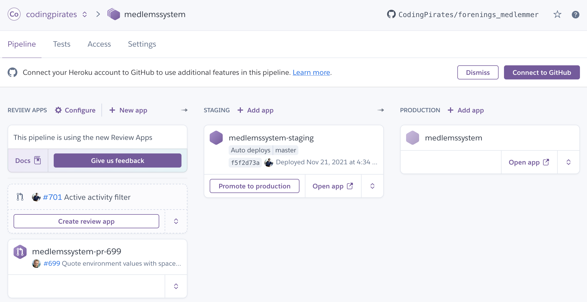
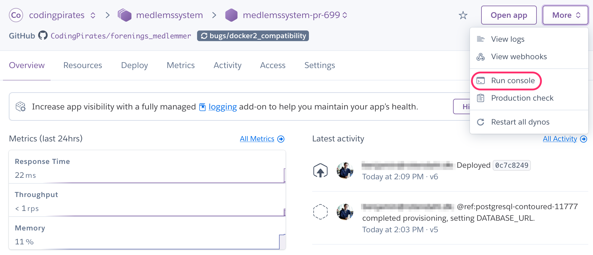

# Deploying changes

We're using [Heroku](heroku.com) for hosting the system, from test to production environments.

You can develop and test locally as described in the [CONTRIBUTING guide](CONTRIBUTING.md), but if you need to deploy changes to a test environment, look later in this document to get access.

## Test environment for testing pull requests

**Note:** This requires that you have been added to the <https://dashboard.heroku.com/teams/codingpirates> team. Reach out in [#medlemssystem_dev](https://codingpirates.slack.com/archives/C4DSXUJBE) Slack channel if you need access. Typically it's only reviewers who needs this access though.

1. Open the Heroku [medlemssystem](https://dashboard.heroku.com/pipelines/fc7c6471-2380-48a0-976f-159cdcd9c452) pipeline
  
1. Click the `Create review app` for the pull request you want to test
1. In the screenshot above, PR `#699` has already been deployed. Click the `Open app` button to open the running site, in this case <https://medlemssystem-pr-699.herokuapp.com/> (will be a unique url for each pull request)
1. In order to get data populated, we need to populate the database, so open `More -> Run console`
  
1. Run `./manage.py import_municipalities members/management/commands/municipalities.csv` to import municipalities
1. Run `./manage.py get_live_data` to get the public live data populated
1. Run `./manage.py shell` to create members in the system. When the shell prompt is ready, type in

   ```python
   from members.tests.factories import MemberFactory
   MemberFactory.create_batch(20)
   ```

1. If you need to use the admin interface, run `./manage.py createsuperuser` and follow instructions for creating an admin account. Now you can log into <https://medlemssystem-pr-699.herokuapp.com/admin/>

## Staging environment

Staging environment allows us to verify changes on production data before going live, and is available at <https://medlemssystem-staging.herokuapp.com>

All merges to `master` branch automatically gets deployed to the staging environment.

## Production environment

This is the site available at <https://members.codingpirates.dk> and is deployed by clicking the `Promote to production` button on the [Medlemssystem pipeline in Heroku](https://dashboard.heroku.com/pipelines/fc7c6471-2380-48a0-976f-159cdcd9c452)
